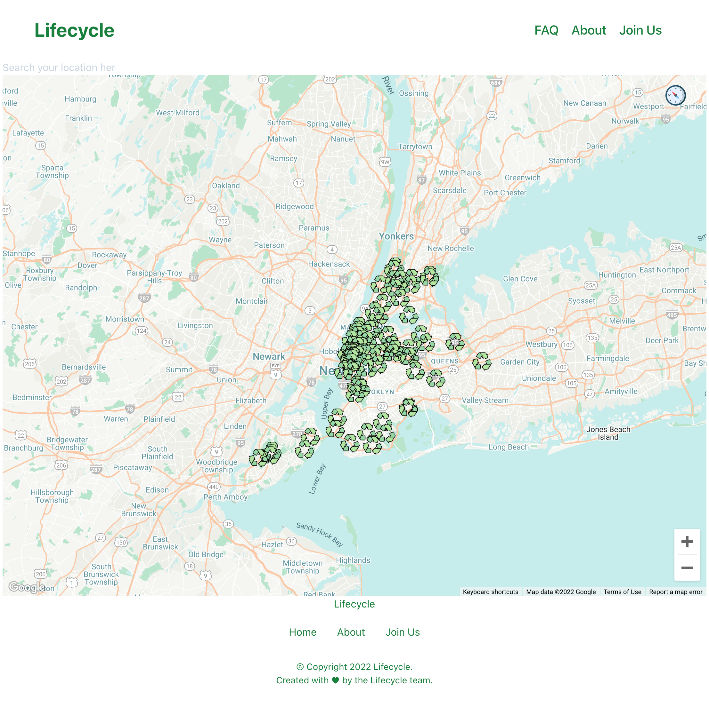
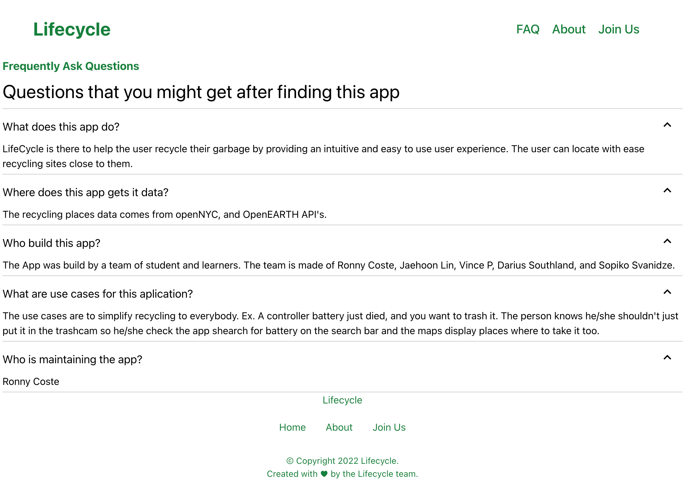
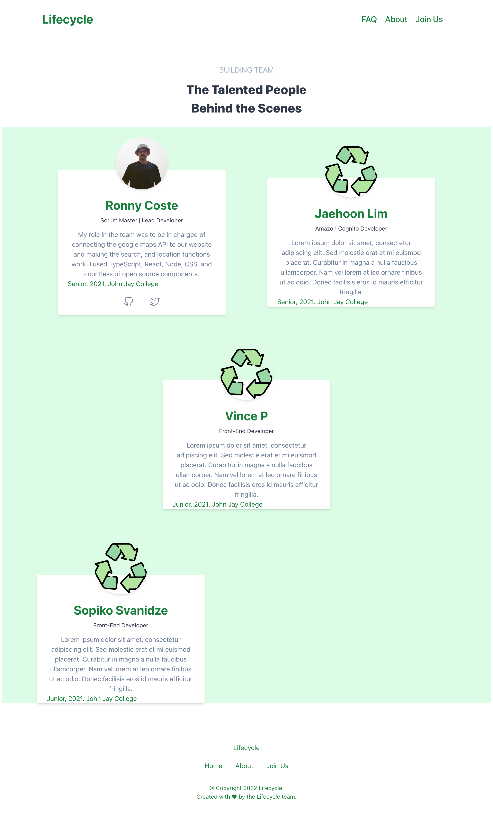
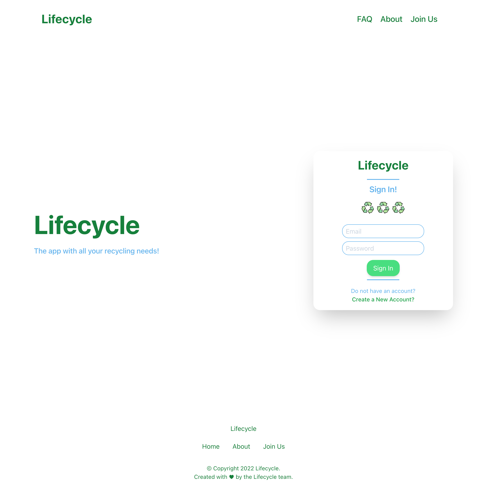

## Lifecycle

[](https://git.io/typing-svg)

### Home Page



### FAQ Page



### About Page



### Login Page



** To do's **
- Connect Amazon cognito or google firebase to login
- Connect earth 911 API to the maps and markers
- convert the maps component to typescript

### Techstack

- 🔥 [Next.js](https://nextjs.org) for Static Site Generator & server-side rendering
- 🎨 Integrate with [Tailwind CSS](https://tailwindcss.com)
- 💅 PostCSS for processing Tailwind CSS and integrated to `styled-jsx`
- 🎉 Type checking [TypeScript](https://www.typescriptlang.org)
- 🖥 [React.js](https://reactjs.org) for the front-end interface
- ✅ Strict Mode for TypeScript and React 17
- 🦊 Husky for Git Hooks
- 🚫 Lint-staged for running linters on Git staged files
- 🤖 SEO metadata, JSON-LD and Open Graph tags with Next SEO
- ⚙️ [Earth 911 API](https://earth911.com) **They shutdown my API access**
- 🗽 [NYC Open data](https://opendata.cityofnewyork.us)


Built-in feature from Next.js:

- ☕ Minify HTML & CSS
- ✅ Cache busting

### Philosophy

- Minimal desgin
- SEO-friendly
- 🚀 Mobile Friendliness

### Requirements

- Node.js 14+ and npm

### Getting started

Run the following command on your local environment:

```
npm install
```

Then, you can run locally in development mode with live reload:

```
npm run dev
```

Open http://localhost:3000 with your favorite browser to see your project.

```
.
├── README.md                # README file
├── next.config.js           # Next JS configuration
├── public                   # Public folder
│   └── assets
│       └── images           # Image used by default template
├── cypress                  # End-to-End testing.
|   ├── e2e                  # Testing files
|   ├── fixtures             # Tests mockup data
|   └── support             
├── src
|   ├── components           # App components
|   |   └── maps             # Maps styles, data and functions
│   ├── layout               # Atomic layout components
│   ├── pages                # Next JS pages
│   ├── styles               # PostCSS style folder with Tailwind
│   ├── templates            # Default template
│   └── utils                # Utility folder
├── tailwind.config.js       # Tailwind CSS configuration
├── firebase-config.js       # firebase configuration
├── cypress.config.js        # cypress configuration
└── tsconfig.json            # TypeScript configuration
```

### Deploy to production

You can see the results locally in production mode with:

```
$ npm run build
$ npm run start
```

The generated HTML and CSS files are minified (built-in feature from Next js). It will also removed unused CSS from [Tailwind CSS](https://tailwindcss.com).

You can create an optimized production build with:

```
npm run build-prod
```

All generated files are located at `out` folder, which you can deploy with any hosting service.


### Deployed with Vercel

[]

### VSCode information (optional)

If you are VSCode users, you can have a better integration with VSCode by installing the suggested extension in `.vscode/extension.json`. The starter code comes up with Settings for a seamless integration with VSCode. The Debug configuration is also provided for frontend and backend debugging experience.

Pro tips: if you need a project wide type checking with TypeScript, you can run a build with <kbd>Cmd</kbd> + <kbd>Shift</kbd> + <kbd>B</kbd> on Mac.

### Contributions

Everyone is welcome to contribute to this project. Feel free to open an issue if you have question or found a bug.

### License

Licensed under the MIT License, Copyright © 2022

See [LICENSE](LICENSE) for more information.
